# WinCarry System Design

WinCarry is a PowerShell toolkit for preparing a Windows reinstall and reducing the manual work needed after the new Windows installation is ready.

The tool does not try to move an old Windows installation into a new one. It builds a reviewable record of the old machine, stores selected backup data in a preserved WinCarry root, then uses that root to guide reinstall and config restore on the new machine.

## Design Goals

- Keep every modifying operation behind dry-run output and explicit confirmation.
- Preserve reviewable artifacts that survive Windows reinstall.
- Prefer package-manager reinstall over copying installed application folders.
- Treat unknown, service-heavy, driver, runtime, security, and system-like apps conservatively.
- Restore user config only from known backup paths and with conflict handling.
- Keep offline-safe workflows from invoking package-manager scan, status, or install commands.

## Non-Goals

- WinCarry is not a full Windows image migration tool.
- WinCarry does not migrate licenses, activations, accounts, certificates, drivers, Windows services, databases, or arbitrary machine state.
- WinCarry does not guarantee that restored apps will run without repair, login, activation, or manual setup.
- Junction mode is not a universal replacement for reinstalling apps.

## Main Components

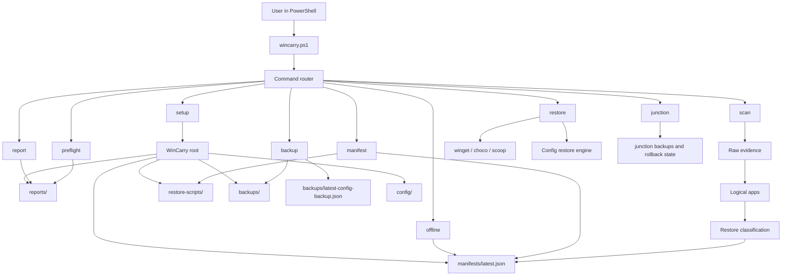

## Module Map

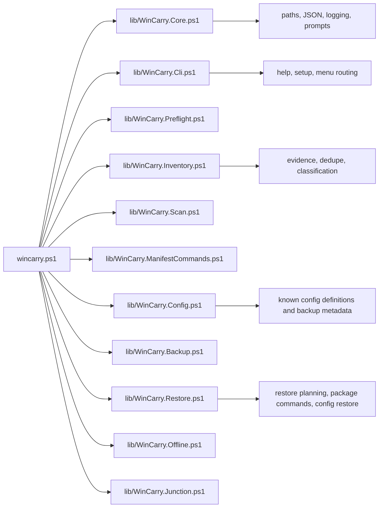

## Artifact Model

The WinCarry root is the durable handoff between the old Windows installation and the new Windows installation.

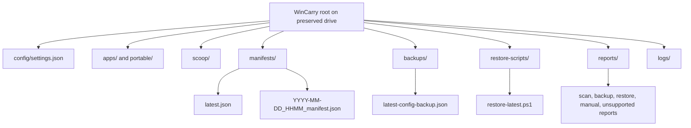

Important artifacts:

- `manifests/latest.json`: source of truth used by restore.
- `backups/latest-config-backup.json`: metadata for the latest config backup.
- `restore-scripts/restore-latest.ps1`: portable launcher for restore after reinstall.
- `reports/*.md` and `reports/*.txt`: human-readable review output.
- `logs/wincarry-YYYY-MM-DD.log`: operation audit log.

## End-to-End Tool Flow

This is the intended user journey from the old Windows installation to a new Windows installation where selected apps are installed again and can be opened.

```mermaid
flowchart TD
  A["Old Windows: user clones or downloads WinCarry"] --> B["Preview WinCarry root setup"]
  B --> C{"Folder plan looks correct?"}
  C -- "No" --> C1["Choose another root or stop"]
  C -- "Yes" --> D["Create WinCarry root"]
  D --> E["Type YES"]
  E --> F["WinCarry root folders are created"]

  F --> G["Capture preflight snapshot"]
  G --> H["Review OS, user, drives, privilege, package managers"]

  H --> I["Preview manifest generation"]
  I --> J["Scan registry, package managers, Start Menu, known folders"]
  J --> K["Deduplicate evidence into logical apps"]
  K --> L["Classify restore strategy and confidence"]
  L --> M{"Manifest plan acceptable?"}
  M -- "No" --> M1["Stop and review warnings or unsupported apps"]
  M -- "Yes" --> N["Generate manifest and reports"]
  N --> O["Type YES"]
  O --> P["Write manifests, reports, manual lists, restore scripts"]

  P --> Q["Preview config backup"]
  Q --> R["Review known config paths and sensitive-file skips"]
  R --> S{"Backup plan acceptable?"}
  S -- "No" --> S1["Stop or adjust expectations"]
  S -- "Yes" --> T["Back up known config files"]
  T --> U["Type YES"]
  U --> V["Write config backups and backup metadata"]

  V --> W["Keep or copy the whole WinCarry root"]
  W --> X["Reinstall Windows"]
  X --> Y["New Windows: install PowerShell and package managers if needed"]
  Y --> Z["Open preserved WinCarry root"]
  Z --> AA["Preview restore from preserved root"]
  AA --> AB["Review package-manager commands, skipped apps, config conflicts"]
  AB --> AC{"Restore plan acceptable?"}
  AC -- "No" --> AC1["Stop and manually review reports"]
  AC -- "Yes" --> AD["Run restore from preserved root"]
  AD --> AE["Choose restore mode and version policy"]
  AE --> AF["Type YES after final plan"]
  AF --> AG["Run planned package-manager install commands"]
  AG --> AH["Choose config restore mode"]
  AH --> AI["Skip, restore missing only, or back up and replace"]
  AI --> AJ["Write restore report and log"]
  AJ --> AK["Open restored apps"]
  AK --> AL{"Apps run correctly?"}
  AL -- "Yes" --> AM["Restore workflow complete for those apps"]
  AL -- "No" --> AN["Use manual report for repair, login, activation, or manual reinstall"]
```

## Before Reinstall Flow

The before-reinstall phase gathers evidence and creates durable restore inputs.

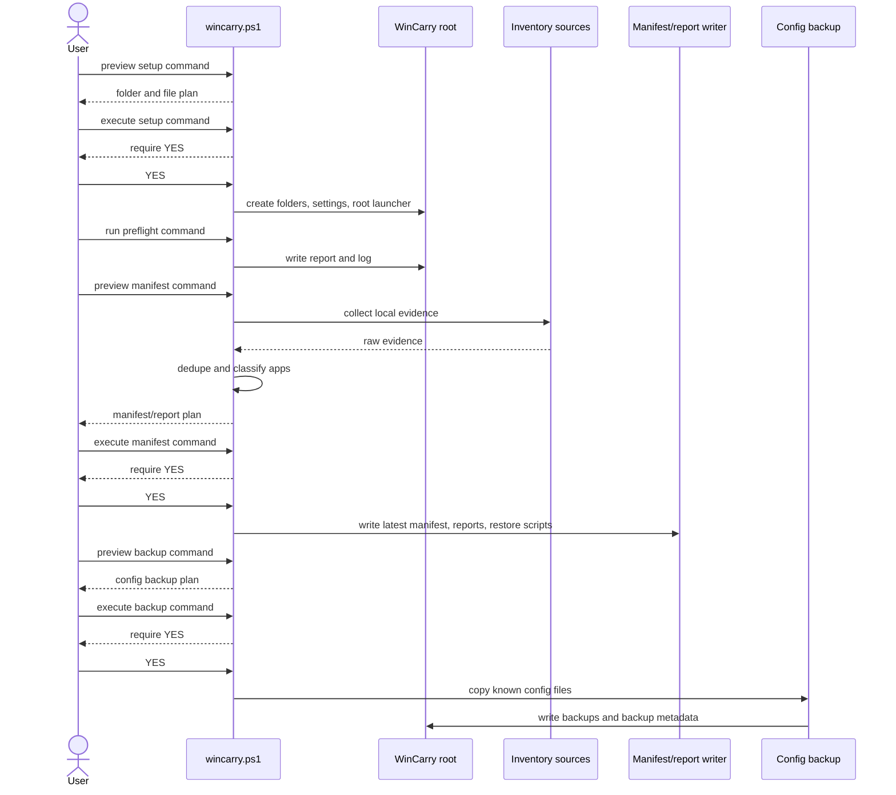

## After Reinstall Flow

The after-reinstall phase uses the preserved root as the source of truth.

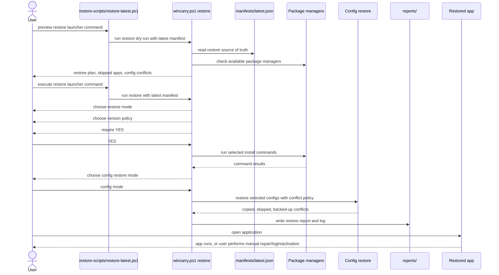

## Restore Decision Flow

Restore is intentionally conservative. A package-manager app can be restored automatically only when the manifest has a package identity and the relevant package manager is currently available.

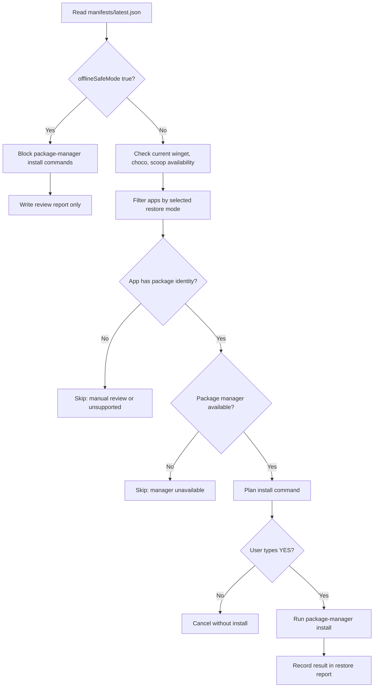

## Config Restore Flow

Config restore happens after the package-manager restore decision. The default mode is to skip config restore unless the user chooses otherwise.

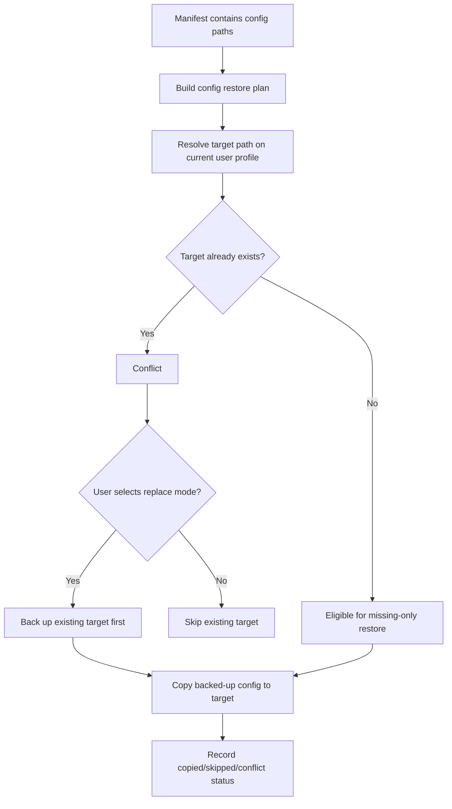

## Offline-Safe Flow

Offline-safe mode is useful when the user wants local artifacts without package-manager scan, status, or install behavior.

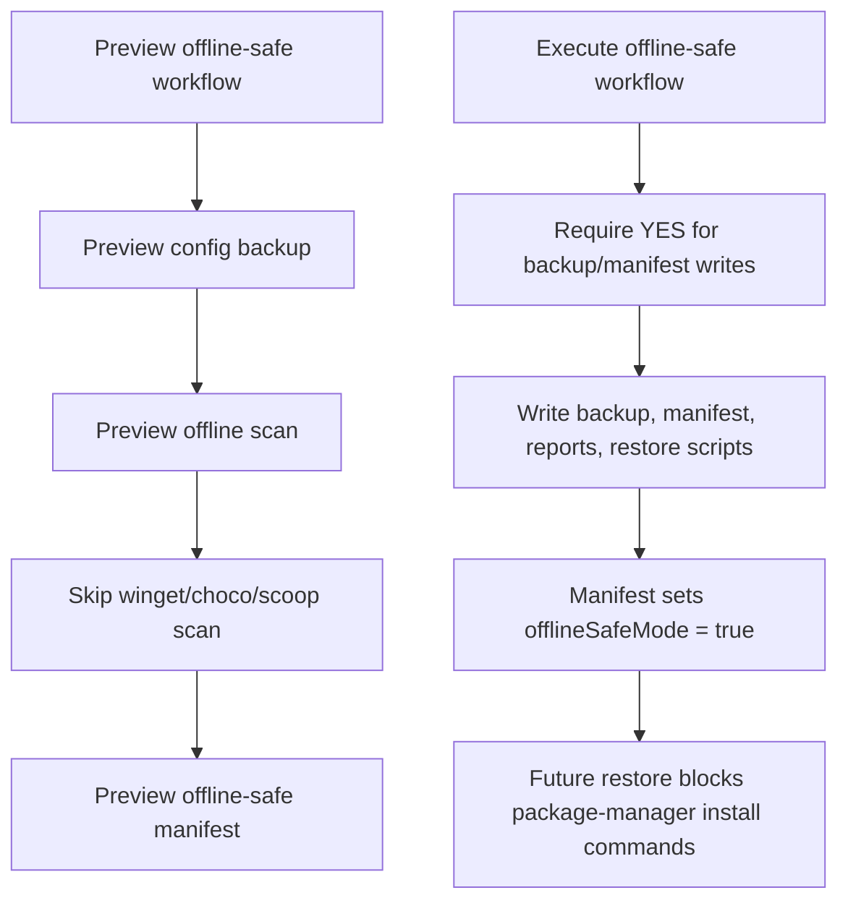

## Safety Gates

Every workflow that can write files or execute install commands follows the same basic control pattern.

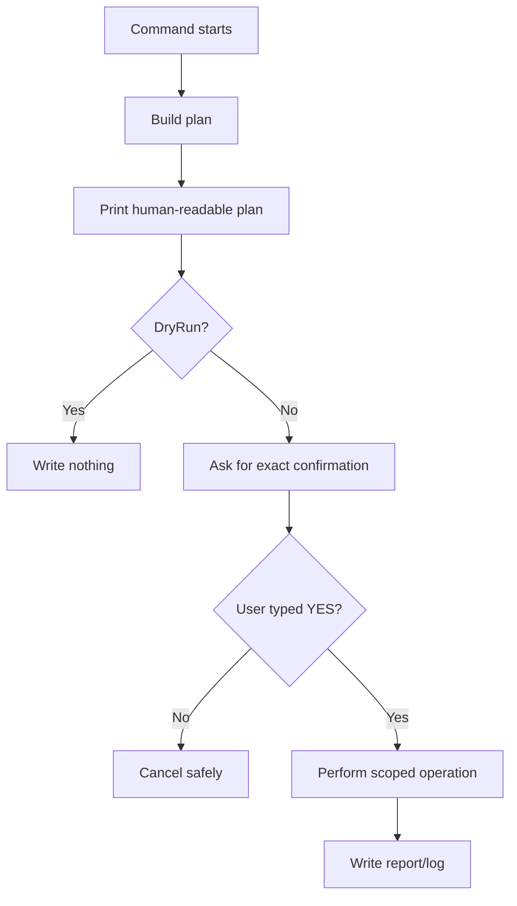

## Success Criteria

A WinCarry restore should be considered successful only for the apps that pass post-restore user validation.

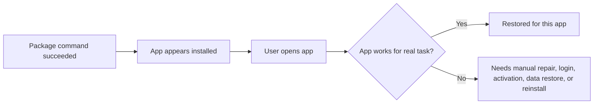

Package-manager success is not the same as application success. The final proof is opening the application and confirming that the user's required workflow works on the new Windows installation.

## Practical User Checklist

Before reinstall, run these commands from the cloned WinCarry repository folder. Replace `D:\WinCarry` with your chosen preserved root if needed.

1. Preview root setup.

```powershell
powershell -NoProfile -ExecutionPolicy Bypass -File .\wincarry.ps1 setup -Root "D:\WinCarry" -DryRun
```

2. Create the WinCarry root after the plan looks correct.

```powershell
powershell -NoProfile -ExecutionPolicy Bypass -File .\wincarry.ps1 setup -Root "D:\WinCarry"
```

3. Capture the preflight snapshot and review the report.

```powershell
powershell -NoProfile -ExecutionPolicy Bypass -File .\wincarry.ps1 preflight -Root "D:\WinCarry"
```

4. Preview manifest generation.

```powershell
powershell -NoProfile -ExecutionPolicy Bypass -File .\wincarry.ps1 manifest -Root "D:\WinCarry" -DryRun
```

5. Generate the manifest, reports, and restore scripts after the plan looks correct.

```powershell
powershell -NoProfile -ExecutionPolicy Bypass -File .\wincarry.ps1 manifest -Root "D:\WinCarry"
```

6. Preview config backup.

```powershell
powershell -NoProfile -ExecutionPolicy Bypass -File .\wincarry.ps1 backup -Root "D:\WinCarry" -DryRun
```

7. Back up known config files after the backup plan looks correct.

```powershell
powershell -NoProfile -ExecutionPolicy Bypass -File .\wincarry.ps1 backup -Root "D:\WinCarry"
```

8. Review the generated handoff artifacts.

```powershell
Get-ChildItem "D:\WinCarry\reports"
Get-ChildItem "D:\WinCarry\manifests"
Get-ChildItem "D:\WinCarry\backups"
Get-ChildItem "D:\WinCarry\restore-scripts"
```

9. Keep or copy the whole `D:\WinCarry` root somewhere that survives reinstall.

After reinstall, run these commands from the new Windows installation after the preserved WinCarry root is available.

1. Preview restore from the preserved root.

```powershell
powershell -NoProfile -ExecutionPolicy Bypass -File "D:\WinCarry\restore-scripts\restore-latest.ps1" -DryRun
```

2. Run restore after the dry-run plan looks correct.

```powershell
powershell -NoProfile -ExecutionPolicy Bypass -File "D:\WinCarry\restore-scripts\restore-latest.ps1"
```

3. Review the latest restore report.

```powershell
Get-ChildItem "D:\WinCarry\reports\restore-*.md" | Sort-Object LastWriteTime -Descending | Select-Object -First 1
```

4. Open each important restored application and confirm that the real workflow works.

5. Use the generated reports for anything that needs manual reinstall, repair, login, activation, or data restore.
